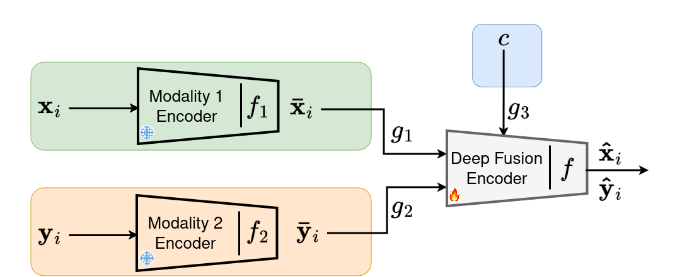
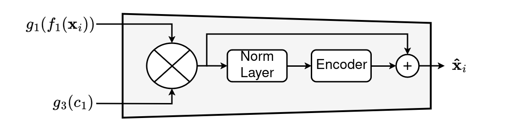
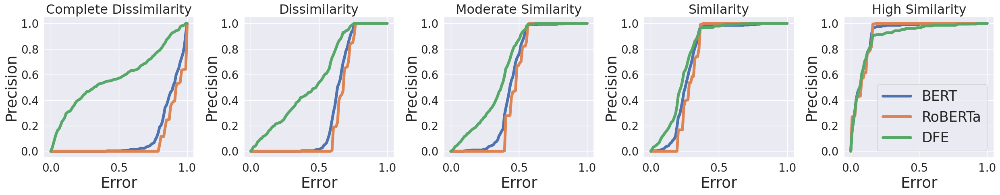
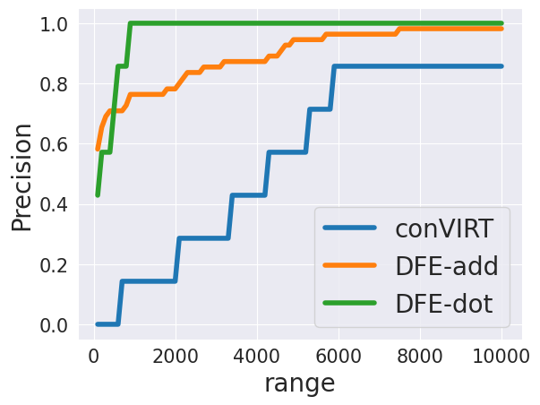

# <center>**Lightweight Cross-Modal Representation Learning**</center>

This repository is an official implementation and applications of Lightweight Cross-Modal Representation Learning (LightCRL).

## Introduction

LightCRL is a cost-effective multimodal alignment method that combines fusion strategies with alignment techniques. By leveraging pre-trained models and a learnable context vector, LightCRL promotes cost-effectiveness and produces semantic-rich multimodal representations.



**Figure: LightCRL framework. Encoders for individual modalities are pre-trained and kept static, while only the deep fusion encoder undergoes training to ensure cost-effectiveness.**
<br>
<br>


**Figure: Deep fusion Encoder (DFE) framework on modality 1.**

<br>
<br>

The fusion operation in the DFE can be:

* Addition
* Multiplication
* Concatenation
* Cross-attention mechanism: using context features as query and modalities features as key and value.

<br>
<br>
<br>

**Abstract.** Fusion strategies, effective in combining data from diverse sources, are common in solving multimodal tasks. However, they face limitations in aligning data distributions across modalities, leading to inconsistencies and challenges in learning robust representations. Multimodal alignment, addressing this issue, often necessitates training "from scratch" with large datasets for optimal results, posing resource and time costs.
To address these constraints, we introduce a lightweight Crosss-Modal Representation Learning method, dubbed LightCRL, amalgamating fusion strategies with alignment techniques. LightCRL aligns multimodal data using pre-trained large models, which remain frozen throughout training. Our approach combines fusion strategy and contrastive learning in two steps, solely training a Deep Fusion Encoder (DFE): 1) DFE fuses embeddings from pre-trained models into a learnable "context" vector, and 2) Leveraging contrastive learning, DFE aligns data from different modalities in latent space to preserve semantic relationships in the input space. By using a learnable context vector to identify each modality, LightCRL allows the DFE to handle inputs with varying distributions using the same parameters, promoting frugality as only DFE parameters are learned during training. Through context-based fusion, LightCRL offers an economical approach for alignment, yielding semantic-rich multimodal representations.


## Applications

We present two applications:

* Text Alignment using pre-trained Large Language Models (LLM)

* Text-Image Alignment using pre-trained Large Language Model (LLM) and Large Vision Model (LVM)


The experiments carried out in this study utilize the COCO Caption dataset for training and several widely-used benchmark datasets for validation purposes.

<center>

| Dataset               | Link                                  
|-----------------------|---------------------------------------
| COCO Captions         | [COCO Captions](https://cocodataset.org/#home)     |
| Microsoft Research Paraphrase Corpus (MRPC)| [MRPC Link](https://www.microsoft.com/en-us/download/details.aspx?id=52398)    
| Quora Question Pairs (QQP)         | [QQP](https://quoradata.quora.com/First-Quora-Dataset-Release-Question-Pairs) 
| Semantic Textual Similarity Benchmark (STSB) | [Pet Dataset Link](http://ixa2.si.ehu.eus/stswiki/index.php/STSbenchmark)  
| CIFAR-10          | [CIFAR-10 Link](https://www.cs.toronto.edu/~kriz/cifar.html)         
| CIFAR-100         | [CIFAR-100 Link](https://www.cs.toronto.edu/~kriz/cifar.html)   
| Tiny ImageNet     | [Tiny ImageNet](https://www.kaggle.com/c/tiny-imagenet)
| Flirckr8k         | [Flirckr8k](https://www.kaggle.com/datasets/adityajn105/flickr8k)      

</center>
<br>
<br>

## Results 
### <center> Text Alignment using pre-trained Large Language Models (LLM) </center>

The aim of this experiment is to demonstrate that models such as BERT and RoBERTa, primarily employed for text encoding, often struggle to effectively capture semantics. The use of LightCRL facilitates alignment between these two models, preserving the semantic content from the original space to the projection space.

Following the training phase, we will assess the performance of the models on three similarity datasets:

* QQP
* MRPC
* STS-B

We will utilize the following annotations:

* DFE-1: DFE employing addition for fusion operation
* DFE-2: DFE employing multiplication for fusion operation
* DFE-3: DFE employing concatenation for fusion operation
* DFE-4: DFE employing additive attention for fusion operation
* DFE-5: DFE employing general attention for fusion operation
* DFE-6: DFE employing scaled dot product attention for fusion operation


### QQP dataset

**Performance on QQP dataset on dissimilarity class**

| Model      | accuracy | precision | recall | F1-score |
|------------|---------------|-----------|-----------|-----------|
| BERT       | 40.82         | 83.38     | 7.86      | 14.37     |
| RoBERTa    | 36.81         | 0.0       | 0.0       | 0.0       |
| DFE-1     | 54.14         | 71.92     | 44.97     | 55.34     | 
| DFE-2     | 57.35         | 68.65     | 59.82     | 63.93     |
| DFE-3     | 54.28         | 73.65     | 43.04     | 54.33     | 
| DFE-4     | 54.79         | 72.52     | 45.80     | 56.14     |
| DFE-5     | 57.70         | 69.80     | 50.30     | 60.63     |
| DFE-6     | 56.73         | 72.33     | 51.03     | 59.84     |
-----------------------------------------------------------------

<br>

**Performance on QQP dataset on similarity class**

| Model      | accuracy | precision | recall | F1-score |
|------------|---------------|-----------|-----------|-----------|
| BERT       | 40.82         | 38.11     | 97.39     | 54.78     |
| RoBERTa    | 36.81         | 36.81     | 100       | 53.81     |
| DFE-1     | 54.14         | 43.61     | 81.79     | 56.89     | 
| DFE-2     | 57.35         | 45.16     | 77.17     | 56.88     |
| DFE-3     | 54.28         | 43.39     | 83.55     | 57.11     | 
| DFE-4     | 54.79         | 44.28     | 80.09     | 57.03     |
| DFE-5     | 57.70         | 45.78     | 75.35     | 56.96     |
| DFE-6     | 56.73         | 45.31     | 79.77     | 57.79     |
-----------------------------------------------------------------
<br>
<br>


### MRPC dataset

**Performance on MRPC dataset on dissimilarity class**

| Model      | accuracy | precision | recall | F1-score |
|------------|---------------|-----------|-----------|-----------|
| BERT       | 64.21         | 29.26     | 9.30      | 14.11     |
| RoBERTa    | 68.38         | 0.0       | 0.0       | 0.0       |
| DFE-1     | 66.42         | 45.74     | 33.33     | 38.56     | 
| DFE-2     | 70.09         | 63.27     | 44.18     | 48.30     |
| DFE-3     | 64.21         | 42.97     | 40.31     | 41.60     | 
| DFE-4     | 68.62         | 50.46     | 41.86     | 45.76     |
| DFE-5     | 59.06         | 37.33     | 43.41     | 40.14     |
| DFE-6     | 65.44         | 44.44     | 37.20     | 40.50     |
-----------------------------------------------------------------

<br>

**Performance on MRPC dataset on similarity class**

| Model      | accuracy | precision | recall | F1-score |
|------------|---------------|-----------|-----------|-----------|
| BERT       | 64.21         | 68.11     | 89.60     | 77.39     |
| RoBERTa    | 68.38         | 68.38     | 100       | 81.22     |
| DFE-1     | 66.42         | 72.61     | 81.72     | 76.89     | 
| DFE-2     | 70.09         | 76.07     | 82.07     | 78.96     |
| DFE-3     | 64.21         | 73.17     | 75.26     | 74.20     | 
| DFE-4     | 68.62         | 75.08     | 81.01     | 77.93     |
| DFE-5     | 59.06         | 71.70     | 66.30     | 68.90     |
| DFE-6     | 65.44         | 73.00     | 78.49     | 75.64     |
-----------------------------------------------------------------
<br>
<br>


### MRPC dataset


**Figure: Performance on each class of MRPC using addition attention operation fusion on DFE.**
<br>
<br>
<br>
### <center> Text-Image Alignment using pre-trained Large Language Model (LLM) and Large Vision Model (LVM) <center>
This experiment aims to align text and images using BERT and ViT, drawing inspiration from methodologies used by models like conVIRT and CLIP. These approaches strive to develop comprehensive semantic image representations based on textual descriptions.

Following the training phase, we proceed to validate the model on various tasks:

* Zero-shot classification 
* Linear classification
* Fine-tuning
* Image-Text retrieval

### Zero-shot classification on CIFAR-10

| Model | top-1-accuracy | top-2-accuracy | top-3-accuracy | top-4-accuracy | top-5-accuracy |
|-------|----------------|----------------|----------------|----------------|----------------|
|conVIRT|  61.12         | 76.53          |     84.26      |     89.2       |    92.95       |
|DFE-1 |  78.26         |   88.69        |    92.5        |       94.87    |    96.48       |
|DFE-2 |  74.68         |   87.62        |    92.96       |      95.56     |    97.07       |
|DFE-3 |  77.37         | 89.30          |  93.78         |    95.95       |    97.44       |
|DFE-4 |  75.73         | 85.9           |   92.10        |     95.41      |    96.83       |
|DFE-5 |  74.29         | 89.16          |  93.58         |    96.02       |    97.54       |
|DFE-6 |  75.62         | 87.37          |  92.62         |    95.26       |    97.00       |
---------------------------------------------------------------------------------------------

### Linear classification on CIFAR-100 (only the linear classifier is trained)

| Model | 20 epochs      | 40 epochs      | 60 epochs      | 80 epochs      | 100 epochs     |
|-------|----------------|----------------|----------------|----------------|----------------|
|conVIRT|  55.67         | 59.22          |     61.29      |     62.14      |    62.71       |
|DFE-1 |  64.63         |   66.78        |    67.93       |       68.88    |    69.37       |
|DFE-2 |  58.96         |   60.77        |    61.76       |      62.58     |    62.93       |
|DFE-3 |  60.88         | 63.07          |  64.46         |    65.79       |    66.65       |
|DFE-4 |  64.74         | 66.22          |   67.07        |     67.55      |    68.39       |
|DFE-5 |  59.06         | 61.32          |  62.64         |    63.52       |    64.26       |
|DFE-6 |  62.75         | 63.37          |  64.57         |    64.98       |    65.29       |
---------------------------------------------------------------------------------------------


### Fine-tuning on Tiny ImageNet

| Model | 20 epochs      | 40 epochs      | 60 epochs      | 80 epochs      | 100 epochs     |
|-------|----------------|----------------|----------------|----------------|----------------|
|conVIRT|  59.00         | 62.71          |     64.45      |     65.37      |    65.89       |
|DFE-1 |  64.49         |   66.31        |    67.60       |       68.12    |    68.91       |
|DFE-2 |  62.24         |   64.45        |    65.42       |      66.33     |    66.90       |
|DFE-3 |  64.40         | 66.71          |  67.94         |    68.75       |    69.35       |
|DFE-4 |  64.49         | 66.31          |   67.60        |     68.12      |    68.91       |
|DFE-5 |  62.62         | 65.23          |  66.63         |    67.36       |    68.30       |
|DFE-6 |  64.21         | 66.09          |  66.70         |    67.74       |    68.18       |
---------------------------------------------------------------------------------------------


### Image-Text Retrieval on Flickr8k

<br>
**Figure: Precision Curve for Image-Text Retrieval on the Flickr8k Dataset. The
’range’ denotes the top-k values, ranging from 100 to 10, 000, where k represents
the number of retrieved results. A retrieval is deemed correct if the true caption
is included within the top-k results for each image. DFE-add corresponds to DFE with addition fusion and DFE-dot to scaled dot product fusion.**

## Installation
### Requirements
* Linux, CUDA >= 12.1
* Python >= 3.9

    We recommend you to use Anaconda to create a conda environment:

    ```bash
    conda create -n lightweight_alignment python=3.9 pip
    ```

    Then, activate the environment:
    ```bash
    conda activate lightweight_alignment
    ```

* Pytorch >= 2.1.1

    For example, if your CUDA version is 12.1, you could install pytorch and torchvision as following:
    ```bash
    conda install pytorch=2.1.1 torchvision=0.16.1 cudatoolkit=12.1 -c pytorch
    ```
* Other requirements
    ```bash
    pip install -r requirements
    ```
## Usage
### Dataset preparation
In this study, we introduce an application utilizing the COCO dataset. Additional datasets can be incorporated by including a `dataset.py` file structured similarly to `coco_dataset.py` to establish pairs, such as (image, text), (text, audio), (image, audio), and so forth.

### Training and evaluation
#### Training on single node
To facilitate the alignment of image-text pairs using ViT and BERT, we suggest developing an application within the `text_image` directory. Similarly, for aligning text-text pairs utilizing BERT and RoBERTa, we recommend creating an application within the `text_text` directory.

* Example to use addition operation in `text_image`:
    ```bash
    cd text_image/addition
    python3 main.py
    ```
After training two models are created `best.pt` and `last.pt`

The same strategy employed for fusion operations can also be applied to other methods, particularly the `text-text` method.

#### Dowstream task `text-image`
* zero-shot validation on CIFAR-10
    ```bash
    cd downstream_task/zero_classification
    python3 zero_shot.py
    ```
* linear classification on CIFAR-100
    ```bash
    cd downstream_task/linear_classification
    python3 linear_classification.py
    ```
* fine-tune on Tiny ImageNet
    ```bash
    cd downstream_task/fine_tuning
    python3 fine_tuning.py
    ```
* image retrieval on Flirckr8k
    ```bash
    cd downstream_task/image_retrieval
    python3 retrieval.py
    ```
### Demo
We suggest creating a notebook demo for both "text-text" and "text-image" methods, utilizing pre-trained weights stored in the `weights` directory, where the addition operation is employed.